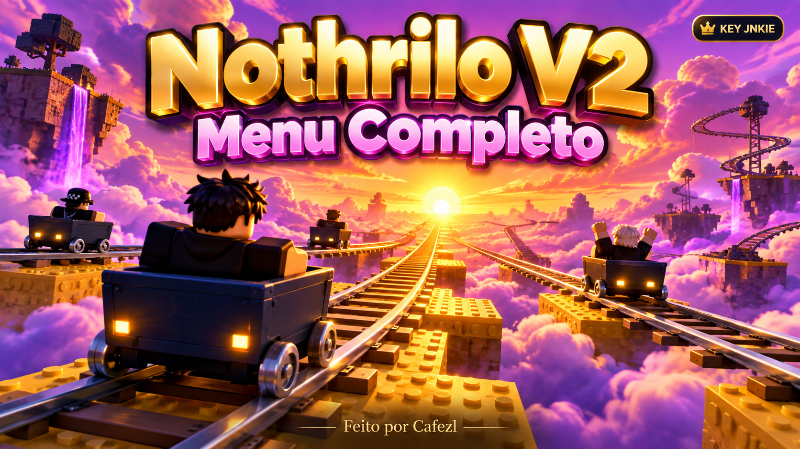

# 🇧🇷 Nothrilo & Cafezitos

  <strong>Nothrilo V2</strong> · key pelo JNKIE + Linkvertise · menu clássico completo 
  <strong>Cafezitos</strong> · interface temática · acesso direto

Menus em Luau para **Cart Ride Around Nothing**, mantidos por **Cafezl** e com a participação do **Cafezitos**.

## Comece pelo Nothrilo V2

O **Nothrilo V2** mantém as abas e funções do menu clássico, mostra a tela de carregamento primeiro e abre a nova tela de key JNKIE depois.

~~~
loadstring(game:HttpGet("https://raw.githubusercontent.com/cafezl/cart-ride-nothing-around/main/nothrilov2/nothrilov2"))()
~~~

O fluxo da key usa o serviço NothriloV2, slug nothrilov2 e o provedor Linkvertise:

1. Clique em **1. GERAR LINK LINKVERTISE**.
2. Abra o link exibido no mesmo navegador e conclua o checkpoint.
3. Se o JNKIE mostrar **Adblock detected**, desative o bloqueador somente para jnkie.com e recarregue.
4. Cole a key de volta no menu e valide.

Link direto configurado: [jnkie.com/get-key/nothrilov2](https://jnkie.com/get-key/nothrilov2).

## Versões disponíveis

| Menu | Arquivo para executar | Acesso |
| --- | --- | --- |
| **Nothrilo V2** | [nothrilov2](nothrilov2/nothrilov2) | Key JNKIE + Linkvertise |
| **Cafezitos** | [Cafezitos.lua](cafezitos/Cafezitos.lua) | Direto, sem key |

### Cafezitos

~~~
loadstring(game:HttpGet("https://raw.githubusercontent.com/cafezl/cart-ride-nothing-around/main/cafezitos/Cafezitos.lua"))()
~~~

O Cafezitos fica preservado como menu separado, com tema de café e seus próprios atalhos.

## O que foi ajustado no V2

- carregamento visual antes da tela de key;
- tela de key com arte de carrinhos em 3D à esquerda e validação à direita, adaptada ao tamanho da janela;
- voo do veículo baseado no controle direto do CRAN UI V3, mantendo a restauração segura de PlatformStand, câmera e movers;
- proteção contra sobreposição de câmeras, voos e conexões de execuções anteriores;
- fallback de assento e perseguição do killer sem validação rígida do carrinho a cada frame;
- ESP que restaura as configurações originais do humanoide;
- estabilizador que remove forças quando o attachment deixa de existir;
- todas as abas do Nothrilo clássico continuam disponíveis.

O arquivo em INSPIRAÇÃO/ é apenas referência de comportamento. Ele contém helpers repetidos e carregadores externos próprios; esses trechos não são executados pelo V2.

## Organização

~~~
Nothrilo & Cafezitos
├── nothrilov2/          # fonte principal da V2
├── cafezitos/           # fontes e diagnóstico do Cafezitos
├── INSPIRAÇÃO/          # referências para comparação
├── assets/              # artes e recursos visuais
├── tests/               # verificações automáticas
└── docs/                # manutenção e segurança
~~~

Os menus mantidos são `nothrilov2/nothrilov2` e `cafezitos/Cafezitos.lua`. A V1, sua API de chaves e as cópias antigas foram retiradas. A V2 valida a key pelo JNKIE.

Os arquivos soltos da raiz foram retirados. Loadstrings que apontavam para `main/Cafezitos.lua`, `main/Nothrilo.lua` ou outras cópias da raiz precisam usar os caminhos das pastas. O loadstring do Nothrilo V2 mostrado acima continua igual.

## Recursos do menu

| Área | Exemplos |
| --- | --- |
| Jogador | voo do veículo, ESP, velocidade, pulo infinito e anti-AFK |
| Teleporte | início, carrinho, checkpoints e sala secreta |
| Carrinho | boost, estabilizador, anti-flip e freio automático |
| Extras | noclip, transparência, gravidade e posição salva |
| Mapa | busca de partes, carrinho próximo e câmera livre |
| Eliminador / Troll | alvo, spectate, câmera e teleporte aleatório |
| Interface | minimizar, reabrir, fechar e atalhos |

### Atalhos principais

V voo · L ESP · P pulo infinito · T teleporte por clique · B boost · 1/2/3 checkpoints · K minimizar · X fechar.

## Desenvolvimento

Edite `nothrilov2/nothrilov2` e `cafezitos/Cafezitos.lua`. A sincronização atualiza apenas as cópias do Cafezitos dentro da pasta:

~~~
pnpm run sync:aliases
pnpm test
pnpm run test:luau
~~~

Os testes Luau exigem luau e luau-compile no PATH ou configurados por LUAU_BIN e LUAU_COMPILE_BIN. Eles verificam sintaxe, aliases, inicialização simulada e a validação JNKIE; não substituem um teste dentro do Roblox.

Nenhum segredo de JNKIE ou Linkvertise deve ser colocado no código ou no README. As credenciais ficam somente nos painéis oficiais.

## Créditos

**Cafezl** · autor do Nothrilo
**Cafezitos** · menu e identidade complementar
Referências de voo e estabilização ficam separadas em INSPIRAÇÃO/.

Projeto independente, sem afiliação com Roblox ou com os criadores do jogo. Use somente em ambientes autorizados e respeite as regras da plataforma.
